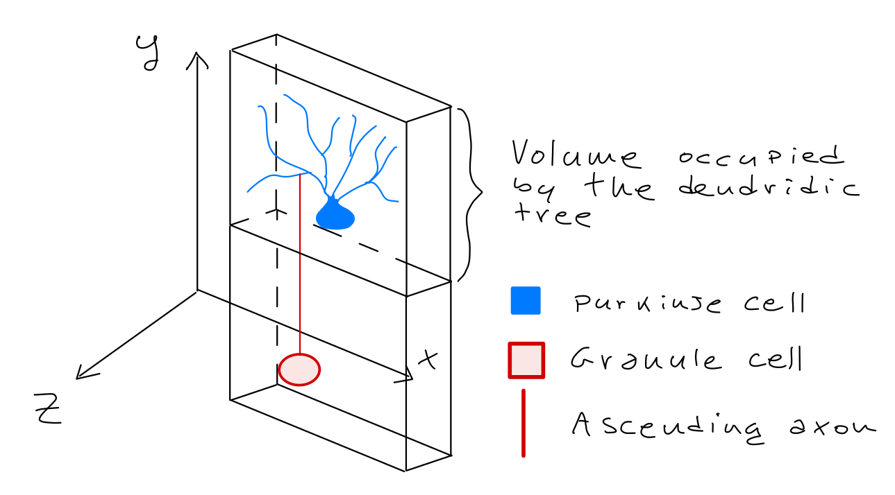

Ascending axons \& Purkinje cells
======================================

Point neuron specs
~~~~~~~~~~~~~~~~~~

Purkinje cells
----------

* Purkinje cells dendridic trees extend for the entire height of the molecular on a parasagittal plane :ref:`[Casali et al., 2019]<pf-purkinje-biblio>`, therefore only x and z coordinate matter (see figure).

* Since ascending axons rise vertically from granule cells, to form a connection between an ascending axon and a Purkinje cell we need to check if the corresponding granule cell is in a parallelepiped below the Purkine cell taken in cosideration :ref:`[Casali et al., 2019]<pf-purkinje-biblio>`.
 
  * The dendridic tree of a Purkinje cell lies inside a parallelipiped whose height if that of the molecular layer, whose width is 130 micrometers and whose depth is 35 micrometers :ref:`[Casali et al., 2019]<pf-purkinje-biblio>`.
  

* Only parallel fibers originated from positioned Granule cells are considered.

* The connection forms an excitatory synapse.

.. _aa-purkinje-biblio:

Bibliography
~~~~~~~~~~~~

* Casali, S., Marenzi, E., Medini, C., Casellato, C., D'Angelo, E. (2019) 'Reconstruction and Simulation of a Scaffold Model of the Cerebellar Network', Front Neuroinform, https://www.frontiersin.org/articles/10.3389/fninf.2019.00037/full. 
