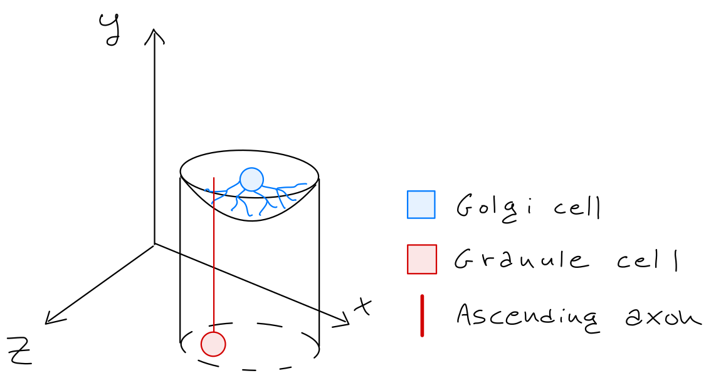

Ascending axons \& Golgi cells
======================================

Point neuron specs
~~~~~~~~~~~~~~~~~~

Golgi cells
----------

* We consider the Golgi cells basal dendridic tree as a half-sphere of radius 50 micrometers :ref:`[Kanichay and Silver, 2008]<aa-golgi-biblio>`.

* Since ascending axons rise vertically from granule cells, to form a connection between an ascending axon and a Golgi cells can be formed if the corresponding granule cell is inside an infinite half-cylinder whose upper base is centered at the Golgi cell :ref:`[Casali et al., 2019]<aa-golgi-biblio>`.

  * Only parallel fibers originated from positioned Granule cells are considered.

* Golgi cells connects with no more than 400 ascending axons, selected from all the possibile connections using a probability rule  :ref:`[Casali et al., 2019]<aa-golgi-biblio>`.
 
* The connection forms an excitatory synapse.
 

.. _aa-golgi-biblio:

Bibliography
~~~~~~~~~~~~

* Casali, S., Marenzi, E., Medini, C., Casellato, C., D'Angelo, E. (2019) 'Reconstruction and Simulation of a Scaffold Model of the Cerebellar Network', Front Neuroinform, https://www.frontiersin.org/articles/10.3389/fninf.2019.00037/full. 

* Kanichay, R. T. and Silver, R. A. (2008) 'Synaptic and cellular properties of the feedforward inhibitory circuit within the input layer of the cerebellar cortex', J Neurosci, 28(36), pp. 8955-67.
