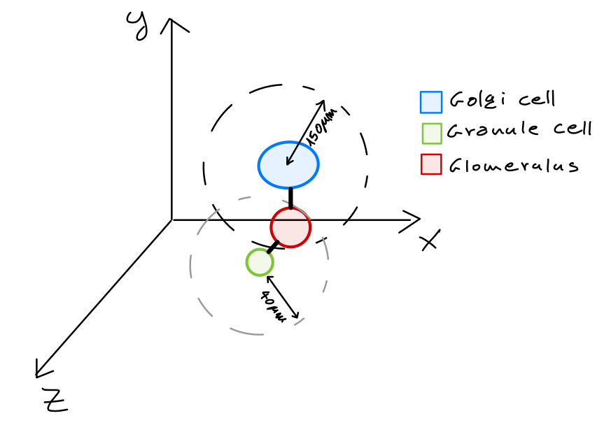

Golgi, glomerulus \& granule cells
======================================

Point neuron specs
~~~~~~~~~~~~~~~~~~

Glomerulus
----------

* Each glomerulus must be connected exactly 1 Golgi cell :ref:`[D'angelo et al., 2013]<golgi-glom-grc-biblio>`.

Golgi cell
----------

.. note::

  The Golgi to glomerulus connection is an intermediate for the Golgi to granule. These connections needn't actually be stored.

* Target a number of glomeruli according to their divergence of 40 :ref:`[Solinas et al., 2010]<golgi-glom-grc-biblio>`.

  * A possible improvement is to make the divergence a distribution :ref:`[Casali et al., 2019]<golgi-glom-grc-biblio>`. 

* Targets must be located within a y-axis aligned cylinder of radius 150 around the Golgi cell, and beneath its soma :ref:`[Casali et al., 2019]<golgi-glom-grc-biblio>`. 

Granule cell
------------

* Granule cells can have no more than 4 dendrites, each with a maximum length of 40μm, developing in all directions :ref:`[Dieudonne, 1998]<golgi-glom-grc-biblio>`.

  * A connection can be generated only if the distance between the soma of the granule cell and the center of a glomerulus is less than granule cell dendrites length :ref:`[Casali et al., 2019]<golgi-glom-grc-biblio>`.

* The granule cell must be connected to glomeruli that originate from different mossy fibers :ref:`[Solinas et al., 2010]<golgi-glom-grc-biblio>`.

Detailed specs
~~~~~~~~~~~~~~

The Golgi cell must contact the granule cell on the compartment right above where the MF contacts it.

.. _golgi-glom-grc-biblio:

Bibliography
~~~~~~~~~~~~

* Casali, S., Marenzi, E., Medini, C., Casellato, C., D'Angelo, E. (2019) 'Reconstruction and Simulation of a Scaffold Model of the Cerebellar Network', Front Neuroinform, https://www.frontiersin.org/articles/10.3389/fninf.2019.00037/full. 

* Dieudonne, S. (1998) 'Submillisecond kinetics and low efficacy of parallel fibre Golgi cell synaptic currents in the rat cerebellum', Journal of Physiology-London, 510(3), pp. 845-866.

* D'Angelo, E., Solinas, S., Garrido, J., Casellato, C., Pedrocchi, A., Mapelli, J., Gandolfi, D. and Prestori, F. (2013) 'Realistic modeling of neurons and networks: towards brain simulation', Funct Neurol, 28(3), pp. 153-66.

* Solinas, S., Nieus, T. and D'Angelo, E. (2010) 'A realistic large-scale model of the cerebellum granular layer predicts circuit spatio-temporal filtering properties', Front Cell Neurosci, 4, p. 12.

