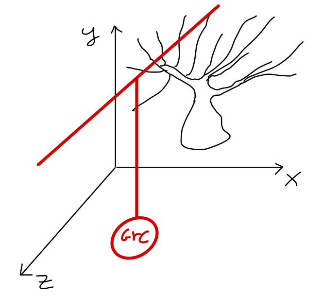

Parallel fibers \& Purkinje cells
======================================

Point neuron specs
~~~~~~~~~~~~~~~~~~

Purkinje cells
----------

* Purkinje cells dendridic trees lie on parasagittal planes (for us the sagittal plane is the xy plane).
  
  * Since their parallel fibers length is of about 2 mm :ref:`[Huang et al., 2006]<pf-purkinje-biblio>`, in :ref:`[Casali et al., 2019]<pf-purkinje-biblio>` they are assumed to extend for the entire simulation volume. Therefore it is sufficient to check whether their x coordinate falls into the dendritic tree.

* Only parallel fibers originated from positioned Granule cells are considered.

* The connection forms an excitatory synapse.

.. _pf-purkinje-biblio:

Bibliography
~~~~~~~~~~~~

* Casali, S., Marenzi, E., Medini, C., Casellato, C., D'Angelo, E. (2019) 'Reconstruction and Simulation of a Scaffold Model of the Cerebellar Network', Front Neuroinform, https://www.frontiersin.org/articles/10.3389/fninf.2019.00037/full. 

* Huang, C. M., Wang, L. and Huang, R. H. (2006) 'Cerebellar granule cell: ascending axon and parallel fiber', European Journal of Neuroscience, 23(7), pp. 1731-1737.
